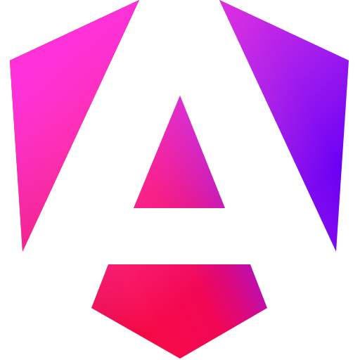
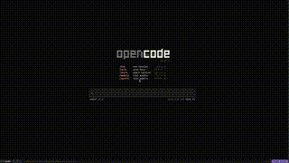

---

  
   
  
  

---

I'm a self-taught full-stack software engineer, primarily web-based but skilled
in various other languages and paradigms.

### About me 👨‍💻

- 💼 Working at <a href="https://enocean.com">EnOcean</a>
- 📅 4 years of experience as a full-stack web engineer, 5+ more years as a hobbyist
- 📚 Self-taught programmer
- ❤️ Love using and contributing to open source projects
- 🎓 Bachelor's in Automation & Electronics

### Workflow 🛠️
  <ul>
    <li>
       ●
      <a href="https://github.com/veracioux/dotfiles">
        
        <code>dotfiles</code>
      </a> ●
      <a href="https://i3wm.org">
        
        <code>i3wm</code>
      </a>
    </li>
    <li>
      <a href="https://github.com/alacritty/alacritty">
        
        <code>alacritty</code></a> ●
        <a href="https://fishshell.com">
          
          <code>fish</code>
        </a>
    </li>
    <li>
       ●
      <a href="https://www.gnu.org/software/emacs/emacs.html">
        
        <code>Emacs</code>
      </a> ●
      <a href="https://code.visualstudio.com/">
        
        <code>VSCode</code>
      </a>
    </li>
    <li>
       ●
       ●
    </li>
  </ul>

---

<table>
  <tr>
    <td>
      <b>Languages</b>  
      <a>
        &nbsp;
        &nbsp;
        &nbsp;
        &nbsp;
        &nbsp;
        
      </a>
    </td>
  </tr>
  <tr>
    <td>
      <b>Frameworks and Technologies</b>  
      <a>
        &nbsp;
        &nbsp;
        &nbsp;
        &nbsp;
        &nbsp;
        &nbsp;
        &nbsp;
        &nbsp;
        
      </a>
    </td>
  </tr>
  <tr>
    <td>
      <b>Other tools</b>  
      <a>
        &nbsp;
        &nbsp;
        
      </a>
    </td>
  </tr>
</table>

<table>
  <tr>
    <td>
      
    </td>
  </tr>
</table>

 

<b>Projects I've worked on that you may find useful</b>

<table>
<tr>
  <th>
    

      
    

    <a href="https://github.com/flameshot-org/flameshot">
      
      Flameshot
    </a> 
    The best screenshot tool :heart:  
    <code>(<a href="https://github.com/search?q=repo%3Aflameshot-org%2Fflameshot+author%3Averacioux&type=pullrequests">my contributions</a>)</code>
  </th>
  <th>
    

      
    

    <a href="https://opencode.ai">Opencode</a> 
    The AI coding agent built for the terminal 🤖 
    <code>(<a href="https://github.com/search?q=repo%3Asst%2Fopencode+author%3Averacioux&type=pullrequests">my contributions</a>)</code>
  </th>
</tr>
<tr>
  <th>
    

      
    

    <a href="https://github.com/veracioux/tuterm">Tuterm</a> 
    A better way to learn the CLI 📖  
    <code>(original creator)</code>
  </th>
  <th>
    <a href="https://github.com/veracioux/shdocker">Shdocker</a> 
    Don't repeat your Dockerfiles 🐳 
    <code>(original creator)</code>
  </th>
</tr>
</table>

